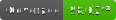

# Codeowners-check

A GitHub Action that validates CODEOWNERS approval requirements for pull
requests while counting the PR author as an eligible owner.

## Inputs

- `github-token`: (default `${{ .github.token }}`) GitHub token used to read PR
  details, reviews, and file contents. Defaults to the token provided by the
  Actions runner.
- `codeowners-path`: (default `.github/CODEOWNERS`) Path to the CODEOWNERS file
  in the repository. The file is fetched from the PR head SHA.
- `codeowners-contents`: Raw CODEOWNERS file contents to use instead of fetching
  the file from the repository. When provided, `codeowners-path` is ignored.
- `ignore-filepaths`: Comma- or newline-separated list of file paths or glob
  patterns where CODEOWNERS rules should be ignored.
- `ignore-authors`: Comma- or newline-separated list of PR authors for which the
  CODEOWNERS check should be skipped entirely.
- `always-succeed-before-approval`: (default `'true'`) When true, the action
  exits successfully if the PR has no approvals yet, even if the CODEOWNERS
  check would otherwise have failed. This avoids spurious CI failures while a PR
  is still awaiting its first review. Most workflows already enforce at least
  one approval via branch protection, making this safe to leave enabled.
- `status-check-name`: When set, the action posts a commit status with this
  name to the PR head SHA on every successful exit (except when exiting early
  because there are no approvals yet and `always-succeed-before-approval` is
  true). Set this to the same string you use as a **required status check** in
  your branch protection rules so that the protection requirement is satisfied
  as soon as the CODEOWNERS check passes.
